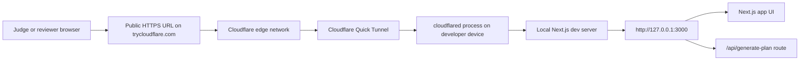
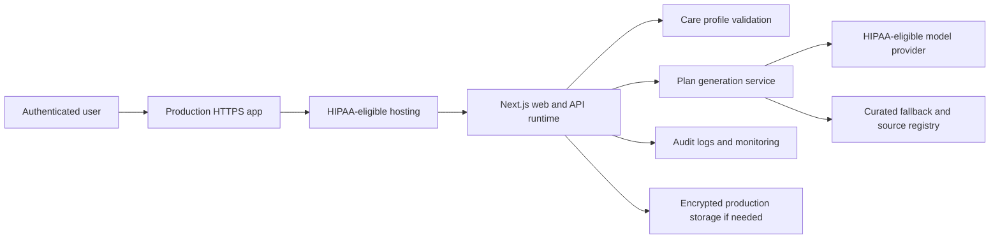
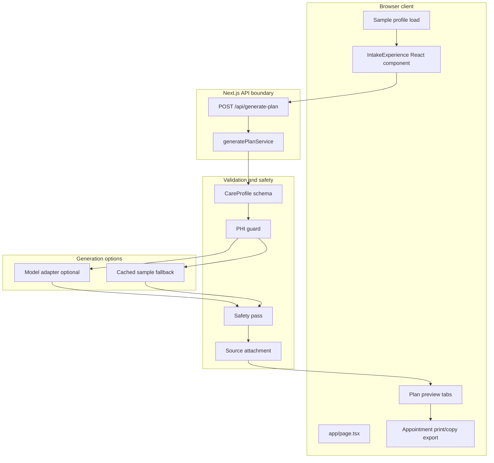
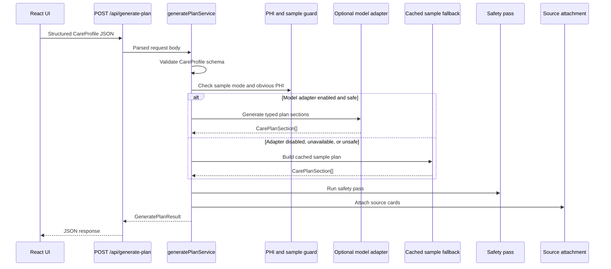

# Health Navigator Architecture

## Current Demo Deployment Architecture

The hackathon demo is hosted from the developer device and exposed through a
Cloudflare Quick Tunnel. This gives judges a public HTTPS URL while the app
continues to run as a local Next.js server.

Current public demo URL:

https://compensation-men-cocktail-feels.trycloudflare.com/



### Request Path

1. A judge opens the public `trycloudflare.com` URL.
2. Cloudflare receives the HTTPS request at the edge.
3. The Quick Tunnel forwards the request to the local `cloudflared` process.
4. `cloudflared` forwards traffic to `http://127.0.0.1:3000`.
5. The local Next.js app serves the page and API route.
6. The app returns generated packet data from the sample-only backend.

### Current Demo Runtime

- Host device: local development machine.
- Public access layer: Cloudflare Quick Tunnel.
- Local app server: Next.js development server on `127.0.0.1:3000`.
- Package/runtime command: Bun running the Next.js scripts.
- Persistence: none.
- Real PHI handling: not allowed.
- Production status: demo-only, not HIPAA-compliant production hosting.

### Restart Commands

Terminal 1 starts the local app:

```bash
cd "/Users/bkadaika/Documents/SKO 27 Hackathon"
PATH="/Users/bkadaika/.bun/bin:$PATH" /Users/bkadaika/.bun/bin/bun run dev --hostname 127.0.0.1
```

Terminal 2 starts a public tunnel:

```bash
cd "/Users/bkadaika/Documents/SKO 27 Hackathon"
PATH="/Users/bkadaika/.bun/bin:$PATH" /Users/bkadaika/.bun/bin/bunx --bun cloudflared@latest tunnel --url http://127.0.0.1:3000
```

Cloudflare Quick Tunnel URLs are temporary. If the tunnel restarts, Cloudflare
may issue a new public URL.

## Production Deployment Target

The current tunnel setup is good for a hackathon demo, but a production version
would need a durable, HIPAA-ready deployment.



Required production additions:

- HIPAA-eligible infrastructure and model vendors.
- Signed BAAs where required.
- Authentication and role-based access control.
- Audit logging and monitoring.
- Encryption, retention, deletion, and consent controls.
- Incident response and breach notification process.
- Formal risk analysis before accepting real patient data.

## Technology Stack

### Frontend

- Next.js 15 App Router for page routing and API routes.
- React 19 for the interactive intake and packet UI.
- TypeScript for typed UI, API, schemas, and data modules.
- CSS in `app/globals.css` for responsive layout, print styling, tabs, forms,
  result cards, and packet export.
- Browser print support for `Print / Save PDF`.
- Clipboard API for `Copy packet text`.

### Backend

- Next.js route handler at `app/api/generate-plan/route.ts`.
- TypeScript service layer in `lib/plan/generate-plan-service.ts`.
- Zod schemas for typed validation of care profiles, plan sections, and source
  cards.
- Optional OpenAI Responses API-compatible adapter in `lib/ai/model-adapter.ts`.
- Cached sample fallback in `data/cached-sample-plan.ts`.
- Source registry in `data/source-registry.ts`.

### Safety And Privacy Guardrails

- `sampleMode` is required for generation.
- PHI guard blocks obvious emails, phone numbers, SSNs, street addresses, and
  non-sample profiles.
- Model adapter is disabled by default with `ENABLE_MODEL_ADAPTER=false`.
- Model adapter requires `OPENAI_API_KEY` and `OPENAI_MODEL` if enabled.
- Model output must match the typed care-plan schema.
- Model output can only reference known source IDs.
- Safety pass blocks or warns on unsafe generated content.
- App has no database and does not persist submitted profile data.

### Local Tooling

- Bun for package installation, scripts, and tests.
- `bun test` for unit/API tests.
- `tsc --noEmit` for typechecking.
- `next build` for production build verification.
- Cloudflare Quick Tunnel for temporary public demo access.

## Application-Level Architecture



### User Interaction Flow

1. User opens the app.
2. User clicks `Load sample profile`.
3. The client loads `sampleCareProfile` into React state.
4. User clicks `Generate plan`.
5. Client posts the structured profile to `/api/generate-plan`.
6. API route parses JSON and calls `generatePlanService`.
7. Service validates the profile schema.
8. Service runs the PHI and sample-mode guard.
9. Generation layer uses the cached sample fallback by default.
10. Safety pass checks plan sections.
11. Source attachment adds trusted source cards.
12. API returns a typed plan result to the client.
13. Client shows `Overview`, `Appointment packet`, and `Evidence details`.
14. User prints, saves as PDF, or copies packet text.

### Backend Generation Flow



### File-Level Map

- `app/page.tsx`: top-level page shell and sample-only warning.
- `components/intake-experience.tsx`: intake form, generation action, result
  tabs, appointment packet, print and copy behavior.
- `app/api/generate-plan/route.ts`: API entrypoint.
- `lib/plan/generate-plan-service.ts`: request validation, PHI guard, safety
  enforcement, and service response shape.
- `lib/ai/generate-plan.ts`: model-adapter-or-fallback orchestration.
- `lib/ai/model-adapter.ts`: optional OpenAI Responses API-compatible adapter.
- `lib/privacy/phi-guard.ts`: synthetic-data guard.
- `lib/safety/safety-pass.ts`: generated-plan safety checks.
- `lib/plan/source-attachment.ts`: source-card attachment.
- `lib/schemas/*.ts`: Zod schemas and TypeScript types.
- `data/sample-profile.ts`: bundled synthetic profile.
- `data/cached-sample-plan.ts`: deterministic fallback packet content.
- `data/source-registry.ts`: trusted source metadata.
- `public/health-navigator-architecture.png`: generated architecture visual.

## Data And Storage Boundaries

The current demo has no database and no persistent server-side profile store.
Profile data exists in browser state, is posted to the local API route, and is
used only to generate the response for that request.

Do not enter real patient information in the demo. A production build would need
the HIPAA controls listed above before storing or processing real patient data.

## Demo Verification Checklist

- Public URL opens over HTTPS.
- `Load sample profile` is visible.
- `Generate plan` is visible.
- Generated response shows `Care packet ready`.
- API returns cached sample fallback in sample mode.
- `Appointment packet` has print and copy controls.
- `Evidence details` shows attached sources and safety labels.
- No real PHI is entered during the demo.
