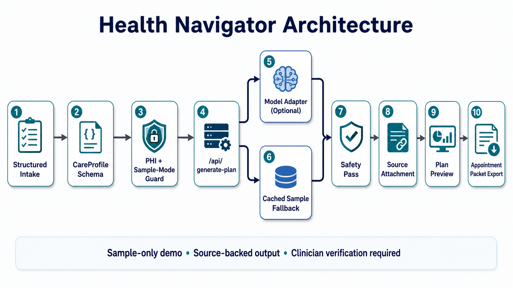
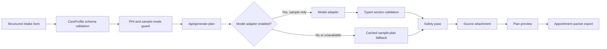

# Hackathon Submission: Health Navigator

## Live Demo

Current demo URL:

https://compensation-men-cocktail-feels.trycloudflare.com/

Note: this is a Cloudflare Quick Tunnel to the local demo server. If the tunnel
or local app quits, restart the local Next app and tunnel using the commands in
the project README or the restart notes from the working session.

Demo access:

- No login is required.
- No real patient data should be entered.
- If the public tunnel returns a Cloudflare `530` or connection error, the app is
  not intentionally gated; the temporary tunnel expired and should be restarted.
- Local fallback for judges or reviewers: run the app on `http://127.0.0.1:3000`
  and use the same demo flow.

## One-Line Pitch

Health Navigator turns a structured new-diagnosis profile into a practical,
doctor-ready care navigation packet with appointment questions, evidence-backed
nutrition and movement guidance, insurance steps, support resources, source
citations, and safety labels.

## Judge Quick Scan

User:

Newly diagnosed breast cancer patients and caregivers preparing for the first
oncology appointment.

Buyer:

Director of oncology patient navigation, VP of patient experience, breast
oncology program leader, payer oncology case-management leader, employer
benefits leader, or cancer advocacy organization.

Reachable community:

Nurse navigators, oncology social workers, breast cancer patient educators,
dietitians, financial counselors, and survivorship/supportive-care teams. These
roles already help patients turn a new diagnosis into practical next steps.

Why this market is reachable:

- Cancer centers and breast oncology programs already run patient education and
  navigation workflows.
- NCI lists 74 NCI-Designated Cancer Centers across 37 states and DC.
- CoC says nearly 1,400 US hospitals and cancer centers are accredited.
- Breast cancer is a focused beachhead with a repeatable diagnosis-to-first-visit
  workflow.

Concrete scope:

- ACS estimates about 321,910 new invasive breast cancer cases in women in the
  US in 2026.
- ACS also estimates about 60,730 new DCIS cases in 2026.
- ACS reports more than 4 million breast cancer survivors in the US.

Expected KPI:

Reduce time from scattered research to a visit-ready packet to under 5 minutes,
while producing a complete packet with diagnosis confirmation questions,
insurance checks, supportive-care guidance, source citations, and clinician
verification labels.

Before and after:

| Before Health Navigator | After Health Navigator |
| --- | --- |
| Search subtype, stage, treatment, survival, and side-effect terms across many tabs. | Enter one structured diagnosis profile. |
| Read generic handouts that do not reflect insurance, constraints, language, baseline diet, movement, or support needs. | Generate a tailored navigation packet from the profile. |
| Call insurance without knowing which network, referral, authorization, or cost questions matter. | Bring a focused insurance and cost checklist. |
| Ask social groups what to ask the doctor. | Bring source-backed provider questions to the appointment. |
| Arrive with scattered phone notes. | Print or copy an appointment-ready handout. |

## Target User

Primary user: a newly diagnosed breast cancer patient or caregiver preparing for
the first oncology appointment.

What they do today:

1. Receive biopsy or imaging results through a clinic call, patient portal, or
   short follow-up visit.
2. Search terms like subtype, stage, biomarkers, surgery, chemotherapy,
   radiation, second opinion, and survival rates across general websites.
3. Read generic clinic handouts that explain cancer broadly but do not connect
   the diagnosis to their insurance, transportation, work, diet, exercise, or
   support constraints.
4. Call the insurer or provider directory to ask whether oncology visits,
   imaging, surgery consults, and genetic testing are in network or require
   prior authorization.
5. Ask friends, social media groups, or survivor communities what questions they
   should ask at the first oncology visit.
6. Write a scattered note in a phone app and arrive at the appointment without a
   structured plan for diagnosis confirmation, treatment questions, insurance
   verification, nutrition, movement, and support needs.

How this helps:

- Converts diagnosis and life-context details into a focused next-step packet.
- Gives the patient concrete questions to ask the oncology team.
- Separates education from decisions that require clinician or insurer
  verification.
- Produces a printable or copyable appointment handout.
- Keeps every recommendation tied to attached source cards and safety labels.

## Measurable Impact And KPI Targets

Hackathon proof point:

- The demo turns a complete synthetic profile into a structured appointment
  packet in one generation step.
- Output contains 6 care-navigation sections, 7 trusted sources, and 7 provider
  questions in the current sample flow.
- Every demo plan item is typed, source-attached, and safety-checked before it
  is shown.
- The public demo requires no login and can be verified by loading the sample
  profile, generating the packet, and opening the appointment export view.

Expected pilot KPIs:

- Time to appointment packet: target under 5 minutes from structured intake to
  printable handout.
- First-visit preparedness: target at least 80% of pilot users report that the
  packet helped them identify questions they would not have asked otherwise.
- Navigation completeness: target 90% of generated packets include diagnosis
  confirmation, care-team questions, insurance verification, supportive-care
  guidance, and source citations.
- Safety quality: target 100% of generated recommendations include either a
  source, a clinician-verification label, or both.

## Market Scope And Reachability

Patient scope:

- The American Cancer Society estimates that in 2026 about 321,910 new invasive
  breast cancer cases will be diagnosed in women in the United States, with
  about 60,730 new DCIS cases and about 42,140 deaths.
- ACS also reports that the average US woman has about a 1 in 8 lifetime chance
  of developing breast cancer and that there are more than 4 million breast
  cancer survivors in the United States.

Reachable care-delivery wedge:

- The National Cancer Institute lists 74 NCI-Designated Cancer Centers across
  37 states and the District of Columbia.
- The American College of Surgeons Commission on Cancer says nearly 1,400 US
  hospitals and cancer centers are CoC-accredited.
- These organizations already have patient navigation, financial counseling,
  social work, dietitian, survivorship, and patient education teams.
- This makes the reachable first buyer a breast oncology program, cancer center,
  patient navigation team, payer case-management group, employer benefits team,
  or patient advocacy organization.

Beachhead buyer:

Cancer centers and oncology navigation programs are the best first buyer. The
economic buyer is typically a cancer center service-line leader, navigation
leader, patient-experience leader, or payer oncology case-management leader. The
day-to-day champion is the nurse navigator or oncology social worker who wants a
repeatable way to help patients prepare for first visits.

Why they would adopt:

- Patient navigators are already asked to help newly diagnosed patients prepare
  for appointments and understand next steps.
- A standardized packet can reduce repeated education work and make handoffs to
  doctors, social work, dietitians, financial counselors, and caregivers cleaner.
- The first version can run as sample-only education content before any HIPAA
  production rollout.

Adoption path:

Start with a synthetic/no-PHI patient education workflow for breast oncology
navigation teams. Then prove patient preparedness metrics. Only after the HIPAA
production path is complete should the product accept real patient data.

Sources:

- American Cancer Society: https://www.cancer.org/cancer/types/breast-cancer/about/how-common-is-breast-cancer.html
- National Cancer Institute: https://www.cancer.gov/research/infrastructure/cancer-centers
- American College of Surgeons Commission on Cancer: https://www.facs.org/quality-programs/cancer-programs/commission-on-cancer/

## Demo Script: 60-90 Seconds

### 1. Problem Setup: 10 Seconds

"A new cancer diagnosis creates an immediate navigation problem. In the US,
hundreds of thousands of women receive a breast cancer diagnosis each year, and
more than 4 million breast cancer survivors are navigating care. The first
appointment is high leverage, but patients are usually still decoding the words
in their report."

### 2. Before Workflow: 15 Seconds

"Today, the patient searches subtype and stage terms online, reads generic
handouts, calls insurance without knowing what to verify, asks friends or social
groups what to ask, and writes a scattered phone note. They arrive with worries,
but not a structured plan."

### 3. Structured Profile: 15 Seconds

Action:

1. Open the live URL.
2. Click `Load sample profile`.

Talking point:

"Instead of uploading pathology or asking for free-form PHI, the demo uses a
synthetic structured profile: diagnosis, tumor subtype, stage if known, age, ZIP
code, insurance, care goals, constraints, diet and exercise baseline, and
support needs."

### 4. Generate The After Moment: 15 Seconds

Action:

1. Click `Generate plan`.
2. Pause on the `Care packet ready` result.

Talking point:

"The app turns that profile into a next-step packet. It summarizes priority
actions, provider questions, supportive care guidance, insurance steps, support
needs, safety notes, and attached sources."

### 5. Show The Core Value: 20 Seconds

Action:

1. Show `Overview`.
2. Click `Appointment packet`.
3. Point to `Print / Save PDF` and `Copy packet text`.

Talking point:

"The key action is preparing for the next appointment. The user can bring this
packet to the care team, ask better questions, verify insurance risk, and avoid
walking in with a vague list of worries."

### 6. Show Evidence And Safety: 15 Seconds

Action:

1. Click `Evidence details`.
2. Point to source cards and safety labels.

Talking point:

"The system does not present itself as a doctor. It labels recommendations,
flags clinician-clearance items, attaches sources, and keeps live AI behind a
sample-mode guard. The default judged demo uses a cached sample fallback for
reliability."

### 7. Close: 10 Seconds

"The next version would prove live provider and insurance verification,
clinical-trial matching, and a production HIPAA path. The demo proves the core
workflow: structured diagnosis context becomes a usable care-navigation packet."

### 8. Impact Close: 10 Seconds

"The measurable goal is simple: reduce time to a useful appointment packet from
an hour of scattered research to under five minutes, while increasing the number
of relevant provider questions and insurance checks a patient brings to the
visit."

## Verification Notes For Judges

The demo is intentionally sample-only, but it should not be access-gated.

Public verification path:

1. Open the current public URL.
2. Click `Load sample profile`.
3. Click `Generate plan`.
4. Confirm the packet shows sections and sources.
5. Open `Appointment packet`.
6. Confirm `Print / Save PDF` and `Copy packet text` are visible.

If public access fails:

- Cloudflare Quick Tunnel links are temporary.
- A Cloudflare `530`, connection timeout, or browser warning means the tunnel
  has expired or the local device is offline.
- Restart the local app and tunnel, then use the new URL printed by Cloudflare.
- Local app command: `bun run dev --hostname 127.0.0.1`.
- Tunnel command: `bunx --bun cloudflared@latest tunnel --url http://127.0.0.1:3000`.

## Architecture

For infrastructure deployment, application-level architecture, and technology
stack details, see [ARCHITECTURE.md](ARCHITECTURE.md).

Editable diagram source:

### Key Components

- `CareProfile` schema: typed structured diagnosis and life-context input.
- `PHI guard`: blocks obvious emails, phone numbers, SSNs, street addresses,
  and non-sample profiles.
- `/api/generate-plan`: backend generation adapter and fallback boundary.
- Cached sample fallback: deterministic demo output with six plan sections.
- Model adapter: optional, disabled by default, and guarded by sample mode.
- Safety pass: catches unsafe claims and enforces warnings/citations.
- Source attachment: attaches trusted evidence cards to generated plan sections.
- Packet UI: overview, appointment export, and evidence details.

### HIPAA Posture

This hackathon app is sample-only and should not collect real patient data. It
is not production HIPAA-compliant software.

Production readiness would require:

- HIPAA-eligible hosting and model vendors.
- BAAs where required.
- Authentication and role-based access controls.
- Audit logs and monitoring.
- Encryption and secrets management.
- Retention and deletion controls.
- Consent language and user-facing privacy controls.
- Risk analysis, incident response, and breach notification workflow.

## Rubric Alignment

### Demand Reality And Problem Severity

Problem definition:

Newly diagnosed cancer patients face immediate, high-stakes navigation work:
understanding the diagnosis, preparing for oncology visits, confirming network
and authorization details, finding support, and deciding which lifestyle changes
are safe during treatment.

Status quo today:

Patients do not start with a blank slate. They already have a chaotic workflow:
portal messages, pathology terms they do not understand, generic handouts,
Google searches, insurer calls, social media advice, and notes scattered across
texts or phone apps. The pain is not lack of information; it is turning too much
unstructured information into the right appointment plan.

Clear pain:

- The patient is overwhelmed at the exact moment decisions start moving quickly.
- Current resources are fragmented across providers, insurers, cancer websites,
  and support organizations.
- Generic AI answers can be unsafe if they do not distinguish education from
  clinician-verified decisions.
- Insurance mistakes can create avoidable cost surprises if network status,
  referrals, prior authorization, imaging, and genetic testing are not checked
  early.
- Supportive-care advice can be confusing because nutrition, movement, and
  complementary options need to be matched to treatment restrictions and
  clinician clearance.

Target user:

Newly diagnosed breast cancer patients and caregivers preparing for the first
oncology appointment.

Measurable proof:

The demo produces a packet with 6 sections, 7 trusted sources, and 7 provider
questions from one structured sample profile. A pilot should measure time to
packet, first-visit preparedness, number of useful questions generated, and
completion of insurance-verification tasks before the first oncology visit.

Impact:

- Social: better appointment preparedness and reduced patient confusion.
- Business: potential navigation layer for clinics, payers, employers, or
  patient advocacy organizations.
- Technical: shows AI can use typed personal context, source attachment, and
  safety boundaries instead of generic chat.

### Target Customer And Market Scope

Clear user:

The demo focuses on one narrow wedge: new breast cancer diagnosis navigation.

Named customer and buyer:

- User: newly diagnosed breast cancer patient or caregiver.
- Buyer: breast oncology program, cancer center, patient navigation team, payer
  case-management organization, employer benefits group, or cancer advocacy
  nonprofit.
- First community to reach: nurse navigators, oncology social workers, breast
  cancer patient educators, and survivorship/supportive-care teams.

Evidence beyond one isolated case:

Cancer diagnosis navigation is a repeatable workflow across oncology care:
patients routinely need diagnosis education, provider questions, support
services, insurance verification, treatment-prep guidance, and survivorship or
supportive-care resources.

Concrete scope:

ACS 2026 statistics estimate about 321,910 new invasive breast cancer cases in
women in the US and more than 4 million US breast cancer survivors. NCI lists 74
NCI-Designated Cancer Centers, and CoC reports nearly 1,400 accredited US
hospitals and cancer centers. That creates both a large patient need and a
reachable provider-side adoption channel.

Why it matters enough to use:

The user is preparing for time-limited, high-value medical appointments. A
clearer question list and packet can directly improve how they use that time.

Novel use of AI:

The product does not simply chat. It transforms a structured profile into a
multi-section action packet with citations, warnings, and exportable output.

Differentiation:

Most patient education tools are generic. Most AI health chat is free-form. This
app sits in between: structured intake, source-backed output, safety gating, and
appointment-ready artifacts.

### Solution Fit And Product Design

Makes life obviously better:

The user goes from "I have a diagnosis and too many tabs open" to "I have a
packet for my appointment."

Before workflow:

Search, copy notes, call insurer, ask friends, write unstructured questions, and
hope nothing important is missed.

After workflow:

Load or enter structured profile, generate packet, review top priorities, print
or copy the appointment handout, and verify items with the care team.

Key action made easier:

Preparing for the next appointment.

Design notes:

- The first screen starts with the actual workflow, not a marketing page.
- The result screen reduces clutter with tabs: overview, appointment packet, and
  evidence details.
- The appointment packet is designed for handoff to a doctor, navigator, or
  caregiver.

### Technical Execution And Demo Proof

Working software:

The app runs locally and through the current public tunnel URL.

Repository evidence:

- `app/api/generate-plan/route.ts`: live API route.
- `components/intake-experience.tsx`: intake, generation, result tabs, print,
  and copy packet behavior.
- `lib/plan/generate-plan-service.ts`: validation, PHI guard, safety enforcement.
- `lib/ai/model-adapter.ts`: optional guarded model adapter.
- `data/cached-sample-plan.ts`: deterministic fallback plan.
- `tests/*.test.ts`: schema, API, safety, PHI guard, model adapter, and service
  tests.

Verification path:

1. Open live URL.
2. Click `Load sample profile`.
3. Click `Generate plan`.
4. Confirm `Care packet ready`.
5. Open `Appointment packet`.
6. Confirm print and copy controls.
7. Open `Evidence details`.

Architecture proof:

- Typed schemas validate inputs and plan sections.
- API route enforces sample mode and fallback behavior.
- Source registry attaches evidence cards.
- Safety pass rejects or warns about risky output.
- Optional model adapter is behind explicit environment flags.

Performance:

The demo uses cached fallback output by default, so generation is fast and
reliable during judging.

### Differentiation

Why this approach is better:

- More actionable than generic education pages.
- Safer than unconstrained health chat.
- More patient-centered than provider-directory search alone.
- More demo-reliable than depending entirely on live model generation.

What makes it harder to copy:

- The value is in the workflow boundary: structured intake, source registry,
  safety labels, fallback behavior, and appointment export.
- The product chooses a narrow, high-pain wedge instead of a broad health chatbot.

What the next version should prove:

- Live provider and accepting-patient verification.
- Live insurance network, prior authorization, denial-risk, and cost navigation.
- ClinicalTrials.gov or trial-matching integration with eligibility caveats.
- HIPAA-ready production architecture and vendor posture.
- Evaluation harness for safety, source grounding, and recommendation quality.

## Judge Talking Points

### If Asked: "Is This Giving Medical Advice?"

"No. The app provides educational navigation support and appointment
preparation. It marks what must be confirmed with a clinician, care team,
dietitian, or insurer."

### If Asked: "Why Breast Cancer First?"

"It is a high-severity, common, information-dense diagnosis where patients need
immediate navigation help. It is narrow enough for a reliable demo but broad
enough to prove a repeatable care-navigation pattern."

### If Asked: "Where Is The AI?"

"The AI role is to transform structured personal context into a source-backed,
safety-labeled action packet. The current judged demo uses cached fallback for
reliability, while the model adapter is implemented behind a sample-mode guard."

### If Asked: "How Would This Become HIPAA-Compliant?"

"The current demo intentionally blocks real patient data. Production would need
HIPAA-eligible vendors, BAAs, auth, RBAC, audit logs, encryption, retention and
deletion controls, consent language, risk analysis, and incident response."

### If Asked: "Why Not Just Use ChatGPT?"

"A generic chat response is not enough for this workflow. Patients need a
repeatable intake, source-backed sections, safety labels, insurance steps,
doctor questions, and a packet they can take to the appointment."

### If Asked: "What Would You Build Next?"

"Provider and insurance verification. That would make the app go from helpful
appointment preparation to active navigation: who can see me, what is covered,
what needs authorization, and what might be denied."

## Final Rehearsal Checklist

- Local app running on `http://127.0.0.1:3000`.
- Public tunnel URL opens.
- Page smoke: `Load sample profile` and `Generate plan` are visible.
- API smoke: `/api/generate-plan` returns cached sample fallback.
- Browser flow: load sample, generate, show packet ready.
- Appointment packet: print and copy controls visible.
- Evidence details: source cards visible.
- No real PHI entered during demo.
- End with the next-version roadmap, not another feature walkthrough.
